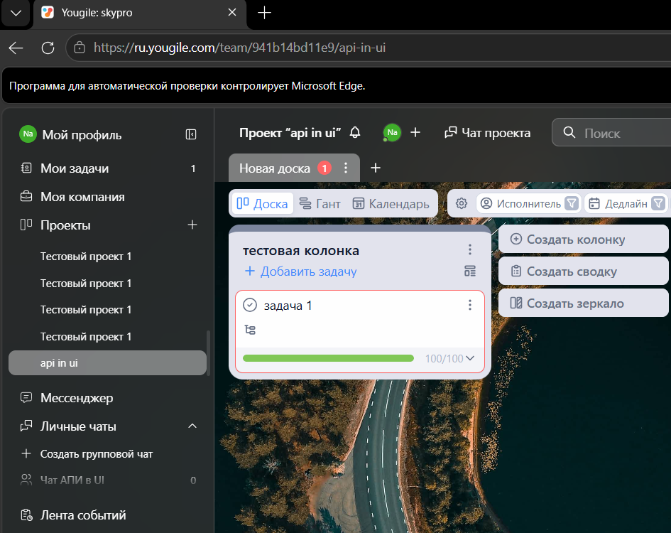
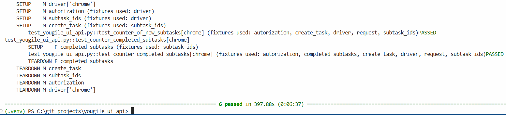

# UI + API  тест для yougile

## Оглавление

1. [Описание](#описание)
2. [Технологический стек](#технологический-стек)
3. [Установка и запуск](#установка-и-запуск)
4. [Эндпоинты](#эндпоинты)
5. [Структура](#структура)
6. [Ограничения](#ограничения)
7. [Дорожная карта](#дорожная-карта)
8. [Скриншоты](#скриншоты)
10.  [Автор](#автор)
11. [Контакты](#контакты)


## Описание 

> Тестовый проект создаёт через API несколько подзадач и основную задачу с ними, выполняет вход в интерфейс и проверяет счётчик подзадач на странице до и после пометки подзадач как выполненных.

> Тесты последовательно выполняются в трех браузерах: `edge`, `firefox`, `chrome`

**Функционал:**

_Предусловия_

-   авторизация
-   создание новой компании
-   создание нового проекта

_Фикстуры для_

- открытия браузера
- авторизации
- создания подзадач
- создания основной задачи
- перевода подзадач в статус выполнено

Некоторые фикстуры реализуют `TEARDOWN` для удаления используемых ресурсов

_UI-тесты проверяют_

-   счетчик новых подзадач
-   счетчик выполненных подзадач


## Технологический стек

- pytest
- requests
- selenium
- dotenv
- браузеры
	- edge
	- firefox
	- chrome


## Установка и запуск

### В терминале

1.  Выбрать папку для клонирования репозитория
	например:
	  ```bash
	 cd C:\git_projects
	 ```
2. Клонировать репозиторий
	```bash
	git clone https://github.com/nanahaya770/yougile_ui_api.git
	```
3. Перейти в папку `yougile_ui_api`
	```bash
	cd yougile_ui_api
	```
4. Создать виртуальное окружение
	```bash
	python -m venv venv
	```
5. Активировать виртуальное окружение
	```bash
	.\venv\Scripts\Activate.ps1
	```
6. Установить зависимости с помощью файла requirements.txt
	```bash
	 pip install -r requirements.txt
	 ```


### На сайте ru.yougile.com 

1. Создать аккаунт 
	> Создать аккаунт на странице [yougile.com](https://ru.yougile.com/) используя электронную почту
2.  Создать новую компанию 
	> В самом низу страницы "Мой профиль"  нажать кнопку "Добавить компанию".
	> Поле ввода заполнить уникальным названием компании, например: 
	> "Тестовая компания 1234".
3. Создать новый проект
	> В разделе "Проекты компании" нажать "добавить проект с задачами".
	> Создать проект с уникальным названием, например: "Тестовый проект 1234"
4. Перейти в созданный проект
5. Переименовать колонку 
	> В разделе "Новая колонка" нажать на три точки и переименовать колонку
	> используя уникальное название, например: "Тестовая колонка 1234"


### На сайте документации yougile.com/api-v2

1.  Получить ID компании
 > Перейти на страницу [Получить список компаний](https://yougile.com/api-v2#/operations/getCompanies)
 > справа в разделе `Body` введите свои данные, например:
 ```json
 {
  "login": "some@example.com",
  "password": "topsecret",
  "name": "Тестовая компания 1234"
}
```
>  нажать на `Send APIRequest`
>  из ответа скопировать  значение __id__ , например: `4f6f0391-0f94-4d30-9b0e-99430a36d4fb`. Он понадобится для получения ключа `API`
2. Получить ключ API
> Перейти на страницу [Создать ключ](https://yougile.com/api-v2#/operations/AuthKeyController_create)
> справа в разделе `Body` введите __id__ полученный в пункте 1. , например:
```json
{
  "login": "some@example.com",
  "password": "topsecret",
  "companyId": "4f6f0391-0f94-4d30-9b0e-99430a36d4fb"
}
```
> из ответа скопировать значение `key`, например: `H6HngIA816fpIhY7tBvWx/it3YbVvEt/33Sk8afA39MCR9a`. 
> Он понадобится для получения `id` колонки
3.  Получить ID колонки
> Перейти на страницу [Получить список](https://yougile.com/api-v2#/operations/ColumnController_search)
> справа в разделе `Auth`  заполнить `Token` используя значение выше найденного `key`, например:
`H6HngIA816fpIhY7tBvWx/it3YbVvEt/33Sk8afA39MCR9a`
>  нажать на `Send APIRequest`
>  в ответе найти название колонки, например "Тестовая колонка 1234"
>  скопировать `id` колонки, он понадобится для следующего пункта


### Ввести свои данные в файл .env.example и conftest.py

Файл `.env.example` скопировать и переименовать в `.env`, подставить свои данные для `LOGIN`, `PASSWORD` и `TOKEN`

В файле conftest.py в константу `COLUMN_ID` вписать значение  `id` колонки из пункта 3

### Установить браузеры

1. edge
2. chrome
3.  firefox


### Запустить тесты 
команда в терминале:
```bash
pytest -vvs --setup-show test_yougile_ui_api.py
```

## Эндпоинты

`BASE_URL` = <https://ru.yougile.com/api-v2>

- задачи/подзадачи - `/tasks`
- id подзадачи - `/tasks/{subtask_id}`


## Структура
```
yougile_ui_api\
│
├── conftest.py  - тестовые данные
├── fixtures.py - фикстуры
├── test_yougile_ui_api.py - тесты
├── README.md - инструкция к работе
├── requirements.txt - зависимости
└── .env.example - пример файла .env
```

## Ограничения

Тестовый проект проверяет счетчик подзадач и счетчик выполненных подзадач.

Тестовый проект НЕ выполняет:
- регистрацию пользователя
- создание компании
- создание проекта

## Дорожная карта

Автоматизировать: 
- создание компании
- создание проекта

## Скриншоты



100 выполненных подзадач ⬆️


Отчет в терминале ⬆️
